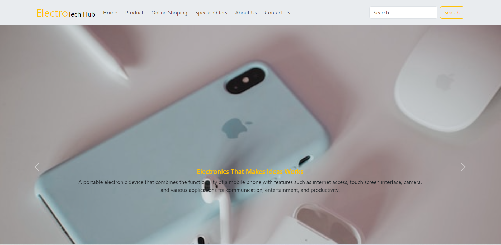

# ElectroTech Hub

## Introduction:

Welcome to ElectroTech Hub. This platform is dedicated to providing you with the latest updates, news, and insights from the world of sports.

## HomePage

## Features:

- Here are some potential features of an "Electro Tech Hub," a platform or store focused on electronic technology and innovation:

-Product Showcase: Display a wide range of electronic devices and gadgets, from smartphones and laptops to smart home appliances and wearable tech, allowing customers to explore the latest innovations.

-Tech Accessories: Provide a range of accessories such as chargers, cables, cases, screen protectors, and more to complement and enhance the usability of electronic devices.

-Collaborations and Partnerships: Partner with electronics manufacturers, tech startups, and innovative companies to introduce exclusive products and limited-edition releases.

-Membership Rewards: Offer loyalty programs, discounts, and exclusive offers to frequent customers, fostering a sense of community and appreciation.

-Secure Shopping Environment: Ensure a secure online shopping environment, safeguarding customer information and providing multiple payment options.

-Responsive Website/App: Offer a user-friendly and responsive website or app that allows customers to browse, shop, and access information seamlessly across different devices.

## Getting Started:
 
 [Visit Our Website](https://app.netlify.com/teams/prajktamhase/overview)

 
